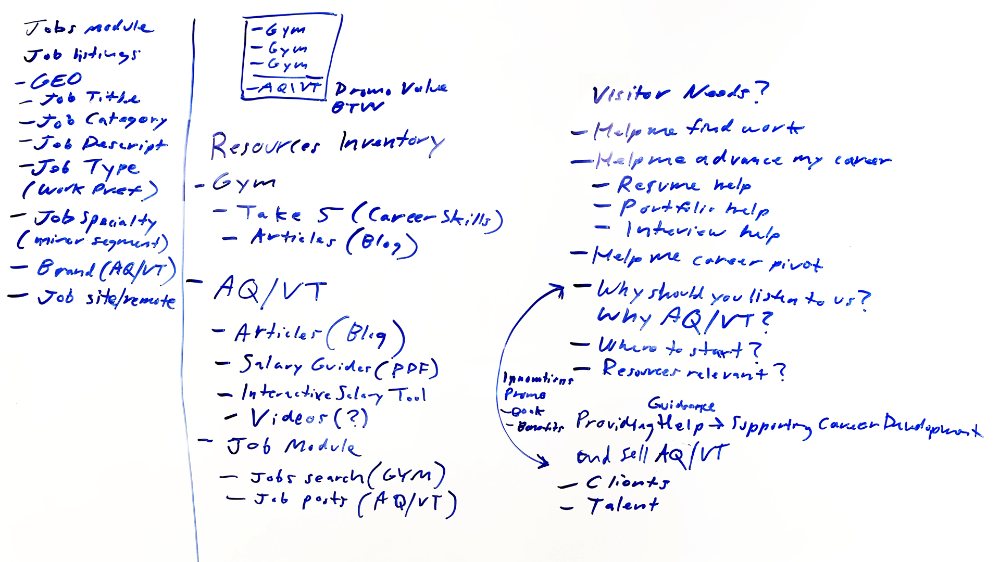

# Jobs

Notes from January 14, 2020 discussion of the jobs page resources and listings search module content.

References:

- Resources: <https://thegymnasium.com/jobs>
- Search: <https://thegymnasium.com/#get-work>

Notes:

Transcript:

## Resources Inventory

- Gymnasium
 - Take 5 (Career Skill tutorials)
 - Articles (Career Skill blog posts)

- AQ/VT
  - Articles (Blog posts)
  - Salary Guides
    - Salary Guides (PDFs)
    - Salary Tool (interactive/web-based)
  - Job Module
   - Jobs search (source GYM)
   - Job posts (source AQ/VT)

### Promo Value

BTW

| Content Hierarchy |
|---|
| Gymnasium  |
| Gymnasium  |
| Gymnasium  |
| AQ/VT |

## Visitor Needs?

- Where to start?
- Help me find work
- Help me advance my career
  - Resume help
  - Portfolio help
  - Interview help
  - Career pivot help
- How are these resources relevant and why?
- Why should you listen to us?
  - Why AQ/VT
  - Innovations (Book, Benefits, etc.)
- Providing guidance/help by supporting career development and sell AQ/VT
  - Audience: Talent
  - Audience: Clients

## Job(s) Module
### Job Listings

- Job Geo location
- Job Title
- Job Description
- Job Type (work preference)
- Job Specialty (minor segment)
- Job on-site/remote
- Brand source (AQ/VT)
